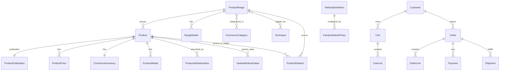

# JaspeArt Ecommerce Data Model

## 1. Objective

Define the operational ecommerce data model needed by JaspeArt to support:

- catalog
- navigation
- search
- product range and variants
- techniques as transversal navigation
- stock and availability
- pricing
- media and ecommerce content
- cart and order snapshot integrity

This document uses DW/ERP evidence as input knowledge, not as a schema template.

Core rule:

DW != Ecommerce DB

---

## 2. Sources reviewed

### Ecommerce repository (this repo)

- README.md
- docs/product/product-vision.md
- docs/discovery/competitive-benchmark.md
- docs/ux/design-principles.md
- docs/discovery/wordpress-as-is-browser-audit.md
- docs/oq/oq-aspirational-v1-capabilities.md

### Analytics / DW repository (jaspeart-analytics)

- README.md
- docs/adr/ADR-001-stock-parser.md
- docs/adr/ADR-002-stock-granularity.md
- docs/adr/ADR-003-Modelo dimensional DW V1 frente a modelo TO-BE.md
- docs/adr/ADR-004-Resolucion provisional de familia y marca.md
- docs/adr/ADR-005-Granularidad de las tablas de hechos del DW V1
- docs/bi/README.md
- docs/bi/BI-V1-catalogo-funcional.md
- docs/bi/BI-V1-semantica-transversal-clasificacion-producto.md
- docs/open_questions/OQ-001..OQ-010
- dbml/modelo_logicoV1.dbml
- dbml/modelo_logicoTOBE.dbml
- sql/staging/*.sql
- sql/dw/dimensions/*.sql
- sql/dw/facts/*.sql

---

## 3. Current DW model

### 3.1 DW entities inventory (structured)

#### D_PRODUCTO

- Purpose: analytical product dimension
- Grain: one row per prod_cod
- Surrogate key: producto_id
- Business key: prod_cod
- Relevant attributes: prod_desc, marca_id_actual, familia_id_actual
- Known relationships:
  - 1:N to F_VENTAS by producto_id
  - 1:N to F_COMPRAS by producto_id
  - 1:N to F_STOCK_SNAPSHOT by producto_id
  - optional N:1 to D_MARCA by marca_id_actual
  - optional N:1 to D_FAMILIA by familia_id_actual
- ERP origin: sto_arti / stg.producto_clean (prod_cod, prod_desc)
- Data quality:
  - OQ-001: products with missing description exist in source
  - OQ-007: sales can contain prod_cod not present in product master
- Potential ecommerce utility:
  - strong as integration identity (ERP product code)
  - weak as publishable catalog object without enrichment
- Main ecommerce limitation:
  - not enough native ecommerce fields (slug, media, publication, variant model, SEO)

FACT / INFERENCE / UNKNOWN

- FACT: product key in DW V1 is prod_cod -> producto_id
- FACT: d_producto is loaded from stg.producto_clean, not from sales master
- FACT: marca_id_actual/familia_id_actual are derived later from latest sales classification
- INFERENCE: classification in d_producto may drift from ERP master if sales lag or are sparse
- UNKNOWN: whether ERP exposes a canonical article master with stable product->family/brand relation

#### D_FAMILIA

- Purpose: analytical family dimension
- Grain: one row per fam_cod
- Surrogate key: familia_id
- Business key: fam_cod
- Relevant attributes: fam_desc
- Known relationships: 1:N with facts; optional relation from d_producto as familia_id_actual
- ERP origin: stg.familia_clean
- Data quality:
  - family resolution in facts is text-based (normalized fam_desc)
- Potential ecommerce utility:
  - useful as input classification and business language
- Main ecommerce limitation:
  - not guaranteed to match desired public navigation taxonomy

FACT / INFERENCE / UNKNOWN

- FACT: DW V1 resolves family in facts by normalized description
- FACT: fam_desc->fam_cod is treated as univocal in current DW decision
- INFERENCE: family can be reused as seed for ecommerce taxonomy but not as final IA
- UNKNOWN: governance owner for future ecommerce category tree

#### D_MARCA

- Purpose: analytical commercial brand dimension
- Grain: one row per mar_desc (normalized)
- Surrogate key: marca_id
- Business key (provisional): mar_desc
- Known relationships: 1:N with facts; optional relation from d_producto as marca_id_actual
- ERP origin: stg.marca_clean, but collapsed by name
- Data quality:
  - multiple mar_cod can map to same mar_desc
- Potential ecommerce utility:
  - brand browsing/filtering is possible using normalized names
- Main ecommerce limitation:
  - does not preserve 1:1 ERP mar_cod identity by design

FACT / INFERENCE / UNKNOWN

- FACT: DW V1 does not model mar_cod as business key in d_marca
- FACT: PEBEO-like multi-code collisions exist
- INFERENCE: ecommerce should keep ERP identifiers separately from display brand identity
- UNKNOWN: final authoritative brand master for ecommerce catalog operations

#### D_CLIENTE

- Purpose: analytical customer dimension
- Grain: one row per cli_cod
- Surrogate key: cliente_id
- Business key: cli_cod
- Potential ecommerce utility: customer migration/join support, analytics
- Main ecommerce limitation: not enough for auth/profile/consent/order lifecycle

#### D_PROVEEDOR

- Purpose: analytical supplier dimension
- Grain: one row per prov_cod
- Surrogate key: proveedor_id
- Business key: prov_cod
- Potential ecommerce utility: procurement/internal operations
- Main ecommerce limitation: usually not a first-class public ecommerce entity

#### D_CALENDARIO

- Purpose: analytical calendar
- Grain: one row per date
- Key: fecha
- Potential ecommerce utility: reporting and snapshots
- Main ecommerce limitation: not a transactional source model for orders/events

#### F_VENTAS

- Purpose: analytical sales fact
- Grain: one row per ticket line
- Natural key: ticket_id + lin_id
- Core fields: dates, product/customer/family/brand keys, units, price, line amount, VAT, totals, es_devolucion
- ERP origin: stg.ventas_clean
- Data quality:
  - technical line exclusions documented
  - prod_cod blank vs unresolved prod_cod are treated differently
  - date semantics still have open question
- Potential ecommerce utility:
  - demand signals, bestseller ranking, taxonomy enrichment
- Main ecommerce limitation:
  - not usable as operational cart/order service backend

#### F_COMPRAS

- Purpose: analytical purchases fact
- Grain: one row per purchase document line
- Natural key: comp_id + lin_id
- Potential ecommerce utility: supply-side intelligence
- Main ecommerce limitation: not an operational inventory reservation model

#### F_STOCK_SNAPSHOT

- Purpose: analytical periodic stock snapshot
- Grain: one row per product per snapshot_date
- Natural key: producto_id + snapshot_date
- ERP origin: aggregated from stg.stock_clean (sum by prod_cod + extract batch)
- Data quality:
  - stock file may contain repeated rows tied to suppliers
  - supplier-level stock cannot be preserved in current extract
- Potential ecommerce utility:
  - baseline inventory sync feed
- Main ecommerce limitation:
  - no reservation lifecycle, no guaranteed real-time freshness

---

## 4. DW vs ecommerce responsibilities

## DW NEEDS

- historical comparability
- additive facts and conformed dimensions
- controlled null handling in analysis
- snapshot and period reporting
- BI semantics and KPI traceability

## ECOMMERCE NEEDS

- publishable catalog objects and statuses
- public identity (slug/URL), structured content, media
- searchable/filterable product model by shopping intent
- fast read paths for PLP/PDP/search/cart
- operational price and availability by current state
- order snapshot persistence (immutable historical purchase context)
- integration reliability and stale-data visibility

Conclusion:

DW focuses on "what happened".
Ecommerce DB must support "what can be sold now" and "how users find and buy it".

---

## 5. Product identity

### Observed keys and semantics

- producto_id:
  - DW surrogate key
  - analytical/internal only
- prod_cod:
  - ERP/business product code
  - current stable cross-table integration key in DW/staging

### Proposed ecommerce identity strategy

Use four identities with explicit scope:

1) commerce_product_id (internal, immutable UUID or bigint)
- purpose: internal FK stability in ecommerce DB

2) erp_product_code (business/integration key; current candidate: prod_cod)
- purpose: sync upsert identity with ERP

3) product_slug (public URL identity, mutable with redirect policy)
- purpose: SEO and human-readable URL

4) external identifiers (0..N)
- purpose: EAN/GTIN, supplier code, legacy WP id, etc.
- model as separate table, not overloaded in product main table

Why:

- avoids coupling public URLs to ERP code changes
- supports migrations and aliasing
- keeps integration robust when public naming evolves

---

## 6. Product / range / variant model

### Domain distinction to enforce

- ERP Article/Reference: source-level commercial reference (prod_cod)
- Commerce Product: sellable unit in ecommerce (usually purchasable)
- Product Range: presentation/grouping layer for near-duplicate references
- Variant: selectable option within a range (color/size/format etc.)

### Proposed baseline

- Introduce ProductRange as optional but first-class ecommerce concept.
- Keep Product (sellable) linked to one optional ProductRange.
- Keep ERP reference mapping at Product level.

Cardinality:

- ProductRange 1:N Product
- Product 0..N ExternalIdentifier
- ProductRange 0..N Technique (through bridge)
- ProductRange 0..N CommerceCategory (through bridge)

Pragmatic rule for V1:

- If reliable range grouping evidence exists -> use ProductRange + variants.
- If not reliable -> publish as standalone Product while preserving future grouping path.

---

## 7. Catalog classifications

Separate and keep both:

1) ERP classification (Family/Subfamily)
2) Commerce classification (public category tree + merchandising placement)

### Recommendation

- Reuse ERP family/subfamily as seed metadata.
- Do not force public IA to be identical to ERP classification.
- Allow product/range to belong to multiple commerce categories.

Cardinality:

- ProductRange N:M CommerceCategory
- ProductRange N:M Technique
- Product N:1 ERPFamily (optional)
- Product N:1 ERPSubfamily (optional)

Traceability:

- keep source_family_code/source_subfamily_code fields (or FK to ERP classification entities)
- keep category assignment provenance (manual/rule/import)

---

## 8. Techniques

Benchmark and UX context indicate techniques are transversal navigation.

Proposed conceptual model:

- Technique (id, slug, name, description, hero_media, seo metadata, sort_order, published)
- ProductRangeTechnique bridge (range_id, technique_id, relevance_weight, source)

Cardinality:

- ProductRange N:M Technique

Why on range (not only product):

- reduces repetitive assignment
- aligns with "discover by technique" navigation
- still allows product-level override when needed

---

## 9. Attributes and filters

Need to differentiate attribute roles.

### Attribute role model

- technical attribute: describes product/range (PDP)
- variant axis: selectable dimension in a range (e.g., color, size)
- filterable attribute: facetable in PLP/search
- searchable attribute: contributes to indexed search text/fields
- informative attribute: shown but not filterable

### Recommended data structure (hybrid)

Avoid both extremes:

- avoid only fixed columns (too rigid)
- avoid ungoverned EAV monster (hard validation/performance)

Use hybrid:

1) AttributeDefinition (governed dictionary)
- code, label, data_type, unit_type, allowed_scope (product/range/variant), is_filterable_default, is_searchable_default

2) FamilyAttributePolicy
- per family/category configuration of allowed/filterable/sortable/required attributes

3) ProductAttributeValue and VariantAttributeValue
- typed value fields for filtering performance (text_value, number_value, boolean_value, option_id)
- optional raw_json for rare long-tail details

4) VariantDimension
- explicit axis definition per range (order and UI behavior)

This supports precision filters without schema explosion.

---

## 10. Pricing

### Minimum model for V1

Need to separate source, synchronized value, and display value.

Proposed entities:

- PriceList (at least one default list for B2C)
- ProductPrice
  - product_id
  - price_list_id
  - currency
  - base_price_net (or gross, but define one canonical stored basis)
  - vat_rate_id
  - gross_price (derived or stored with consistency check)
  - promo_price (optional simple override)
  - valid_from / valid_until (optional for simple campaign window)
  - source_system
  - source_updated_at
  - synced_at

### Ownership (initial)

- operational master: ERP (PROPOSED, pending formal confirmation)
- ecommerce stores synchronized operational copy for fast reads
- display value derived in ecommerce from synchronized values and tax config

V1 advice:

- no advanced promo engine yet
- support one active promo override per product in controlled windows

---

## 11. Inventory

Do not use DW f_stock_snapshot as operational backend.

Proposed ecommerce inventory concept:

- CommerceInventory
  - product_id
  - quantity_on_hand
  - quantity_reserved
  - quantity_available
  - stock_status (IN_STOCK | OUT_OF_STOCK | UNKNOWN)
  - source_system
  - snapshot_at (source timestamp)
  - synced_at (import timestamp)
  - is_stale flag

V1 semantics:

- quantity_available = max(quantity_on_hand - quantity_reserved, 0)
- if source timestamp missing or stale beyond threshold -> stock_status UNKNOWN

Multi-warehouse:

- not required in V1 unless evidence confirms operational need
- keep schema extensible via optional inventory_location_id nullable field (POST-V1 activation)

---

## 12. Publication

Need explicit distinction:

- exists in ERP
- eligible for ecommerce
- currently published

Proposed minimal model:

- ProductPublication
  - product_id
  - publishable (boolean)
  - publication_status (DRAFT | READY | PUBLISHED | ARCHIVED | BLOCKED)
  - published_from
  - published_until
  - reason_not_publishable (enum/text)
  - reviewed_at

This enables handling of:

- obsolete references
- out-of-stock policies
- service/activity-like codes not intended as normal ecommerce product

---

## 13. Media

Proposed conceptual model:

- MediaAsset
  - media_id, storage_key/url, mime_type, width/height, alt_text_default, source, created_at
- ProductMedia
  - product_id, media_id, role (PRIMARY, GALLERY, SWATCH, TECHNICAL), sort_order
- RangeMedia
  - range_id, media_id, role, sort_order
- VariantMedia (optional)
  - variant_product_id, media_id, role, sort_order

Rules:

- support multiple images with explicit ordering
- support primary image at product and range level
- support alt text governance

---

## 14. Ecommerce content

Separate content by responsibility.

### Product-bound content (belongs to product/range)

- commercial_name
- short_description
- long_description
- ideal_for
- how_to_use
- technical_information

### Independent content entities (lightweight V1)

- Guide
- TechniqueEditorial

with relation bridges to products/ranges/techniques.

V1 should not create a full CMS replacement.
Use minimal structured content entities plus references.

---

## 15. Relationships / merchandising

Prepare explicit relationship types, but keep governance simple.

- ProductRelation
  - source_product_or_range_id
  - target_product_or_range_id
  - relation_type (COMPATIBLE_WITH | RECOMMENDED_WITH | ALTERNATIVE_TO | BELONGS_TO_RANGE)
  - source (manual | rule | import)
  - priority
  - active

V1 value hierarchy:

- BELONGS_TO_RANGE: MUST if range exists
- ALTERNATIVE_TO: SHOULD
- RECOMMENDED_WITH (contextual complements): SHOULD
- COMPATIBLE_WITH: SHOULD where technical compatibility matters

No recommender algorithm in V1.

---

## 16. Orders high-level model

Catalog is focus, but order domain must preserve historical truth.

Minimal high-level entities:

- Customer
- Address
- Cart
- CartLine
- Order
- OrderLine
- Payment
- Shipment

Critical rule:

OrderLine must store immutable snapshot fields, not only FK to current product.

OrderLine snapshot minimum:

- erp_product_code_at_purchase
- product_name_at_purchase
- variant_descriptor_at_purchase
- unit_price_at_purchase
- vat_rate_at_purchase
- quantity
- line_total_at_purchase

So historical orders survive catalog edits, unpublishing, and renames.

---

## 17. Data ownership matrix

Status legend:

- CONFIRMED: backed by current documented evidence
- PROPOSED: recommended ownership pending decision
- UNKNOWN: no reliable decision evidence yet

| Domain/Data | ERP | Ecommerce | Master | Sync direction | Status | Notes |
|---|---|---|---|---|---|---|
| ERP product code (prod_cod) | yes | yes | ERP | ERP -> Ecommerce | CONFIRMED | Current integration key in DW/staging |
| Product canonical internal id | no | yes | Ecommerce | n/a | PROPOSED | Internal FK stability |
| Product name (source) | yes | yes | ERP (source) | ERP -> Ecommerce | PROPOSED | Source description exists but can be weak |
| Ecommerce commercial name | maybe | yes | Ecommerce | optional write-back none | PROPOSED | Needed for UX copy quality |
| Family | yes | yes | ERP (classification source) | ERP -> Ecommerce | CONFIRMED | Exists in DW as dimension |
| Subfamily | unclear | yes | UNKNOWN | UNKNOWN | UNKNOWN | Not consolidated in DW V1 |
| Commerce category | no | yes | Ecommerce | n/a | PROPOSED | Public IA should not be ERP-locked |
| Brand code identity | yes | yes | ERP | ERP -> Ecommerce | UNKNOWN | DW collapses to name for analytics |
| Brand display name | yes | yes | Ecommerce/ERP hybrid | ERP -> Ecommerce + curation | PROPOSED | Normalize for UX/search |
| Technique | no clear master | yes | Ecommerce (initial) | manual/import | PROPOSED | Transversal navigation capability |
| Technical attributes | partial | yes | Hybrid | ERP -> Ecommerce + enrichment | PROPOSED | Requires family policy |
| Range/variant grouping | not explicit | yes | Ecommerce (derived/governed) | import/manual/rule | PROPOSED | OQ on reliable grouping key |
| Price base | yes | yes | ERP | ERP -> Ecommerce | PROPOSED | Needs formal confirmation |
| VAT rate | yes | yes | ERP/Tax policy | ERP -> Ecommerce | PROPOSED | Must be explicit in pricing model |
| Stock quantity | yes | yes | ERP | ERP -> Ecommerce | PROPOSED | No DW as operational backend |
| Availability status | partial | yes | Ecommerce derived | derived from inventory | PROPOSED | Include UNKNOWN state |
| Images | weak/unknown | yes | Ecommerce | external/ERP -> Ecommerce | PROPOSED | UX requirement, likely not ERP master |
| Product long descriptions | partial/unknown | yes | Ecommerce (initial) | manual/import | PROPOSED | Needed for PDP quality |
| SEO metadata | no | yes | Ecommerce | n/a | PROPOSED | Slug/meta ownership |
| Publication state | no | yes | Ecommerce | n/a | PROPOSED | Critical for catalog vs publishable |
| Customer account data | maybe legacy | yes | Ecommerce | Ecommerce -> ERP (order context) | PROPOSED | Subject to final architecture |
| Order lifecycle | maybe in ERP | yes | Ecommerce (transaction) | Ecommerce -> ERP | PROPOSED | Keep sync strategy explicit |
| Payment status | gateway/ecom | yes | Ecommerce + PSP | PSP -> Ecommerce | PROPOSED | Not a DW concern |
| Shipment state | logistics/ecom | yes | Ecommerce/logistics | carrier/ERP -> Ecommerce | PROPOSED | V1 simple model |
| Promotions | maybe | yes | Ecommerce (simple V1) | optional ERP -> Ecommerce | UNKNOWN | Avoid complex promo engine V1 |

---

## 18. ERP -> Commerce synchronization considerations

Conceptual flow:

ERP extract -> transform -> commerce import -> ecommerce DB

Design requirements:

- every synchronized entity keeps source_system and source_identifier
- synced_at and source_updated_at stored explicitly
- import_batch_id and import_status for traceability
- idempotent upsert by business integration key
- stale detection and deactivation policy explicit

Operational patterns to support:

- full load bootstrap
- incremental updates
- upsert semantics
- deactivate/missing strategy with safety (soft deactivate first)
- error quarantine for invalid records (do not block all catalog unless critical)

Important separation:

- reuse extraction knowledge/code from analytics project: allowed
- using DW analytical tables as ecommerce runtime backend: not allowed

---

## 19. Proposed conceptual model

Key conceptual notes:

- Product is the sellable transactional unit.
- ProductRange is optional grouping for UX/merchandising and variant selection.
- Technique and CommerceCategory are transversal/public navigation constructs.
- Inventory and Price are operational current-state models.
- OrderLine stores historical purchase snapshot independent of current product fields.

---

## 20. Proposed logical model

### 20.1 ERPReference

- Purpose: map source ERP identity to ecommerce product
- Key fields: erp_reference_id, source_system, erp_product_code, product_id
- Relationships: N:1 to Product
- Master/source: ERP code is source; mapping governed by Ecommerce
- Required V1?: MUST
- Known source: prod_cod from staging/DW evidence
- Open Questions: additional external identifiers completeness

### 20.2 Product

- Purpose: sellable item in ecommerce
- Key fields: commerce_product_id, sku_display(optional), commercial_name, status
- Relationships: N:1 ProductRange(optional), 1:1 ProductPublication, 1:N media/prices/attributes
- Master/source: Hybrid (ERP + Ecommerce enrichment)
- Required V1?: MUST
- Known source: ERP prod_cod and descriptions; enrichment needed
- Open Questions: naming ownership and publishability policy

### 20.3 ProductRange

- Purpose: group related products/variants for reduced catalog noise
- Key fields: range_id, range_name, slug, status
- Relationships: 1:N Product, N:M Technique, N:M CommerceCategory
- Master/source: Ecommerce
- Required V1?: SHOULD (MUST where data supports)
- Known source: inferred from catalog patterns, not explicit in ERP extracts
- Open Questions: reliable grouping key and governance

### 20.4 VariantDimension

- Purpose: define selectable axes per range
- Key fields: range_id, dimension_code, display_order
- Relationships: 1:N VariantAttributeValue
- Master/source: Ecommerce
- Required V1?: SHOULD
- Known source: benchmark + UX requirements
- Open Questions: which dimensions are truly available by family

### 20.5 AttributeDefinition

- Purpose: governed dictionary of attributes
- Key fields: attribute_code, data_type, unit_type, scope
- Relationships: 1:N value tables, 1:N family policies
- Master/source: Ecommerce governance
- Required V1?: MUST
- Known source: inferred from UX/filter needs and partial ERP fields
- Open Questions: family-level reliable attribute coverage

### 20.6 FamilyAttributePolicy

- Purpose: configure attributes by family/category
- Key fields: family_or_category_id, attribute_code, is_filterable, is_required
- Relationships: N:1 AttributeDefinition
- Master/source: Ecommerce
- Required V1?: MUST
- Known source: benchmark requirement for family-specific filters
- Open Questions: authoritative family taxonomy and owner

### 20.7 ProductAttributeValue

- Purpose: technical attributes for PDP/search/filtering
- Key fields: product_id, attribute_code, typed values
- Relationships: N:1 Product, N:1 AttributeDefinition
- Master/source: Hybrid
- Required V1?: MUST
- Known source: partial ERP + ecommerce enrichment
- Open Questions: fill strategy for missing technical data

### 20.8 VariantAttributeValue

- Purpose: values for variant selection dimensions
- Key fields: product_id, dimension_code, option/value
- Relationships: N:1 Product
- Master/source: Hybrid
- Required V1?: SHOULD
- Known source: not explicit in current DW extracts
- Open Questions: variant data source readiness

### 20.9 ERPFamily / ERPSubfamily

- Purpose: preserve source classification traceability
- Key fields: source codes and labels
- Relationships: optional from Product
- Master/source: ERP
- Required V1?: SHOULD
- Known source: family yes; subfamily unclear
- Open Questions: subfamily availability and reliability

### 20.10 CommerceCategory

- Purpose: public IA category navigation
- Key fields: category_id, parent_id, slug, name, status, sort_order
- Relationships: N:M with ProductRange
- Master/source: Ecommerce
- Required V1?: MUST
- Known source: UX/product strategy evidence
- Open Questions: governance and migration policy

### 20.11 Technique

- Purpose: transversal discovery path
- Key fields: technique_id, slug, name, description, hero_media_id, published
- Relationships: N:M with ProductRange
- Master/source: Ecommerce
- Required V1?: MUST (initial reduced scope)
- Known source: benchmark + product vision
- Open Questions: initial technique set and maintenance owner

### 20.12 ProductPublication

- Purpose: represent eligibility and live visibility
- Key fields: publishable, publication_status, dates, reason_not_publishable
- Relationships: 1:1 Product
- Master/source: Ecommerce
- Required V1?: MUST
- Known source: product vision + catalog publication principle
- Open Questions: exact publication rule

### 20.13 MediaAsset / ProductMedia / RangeMedia

- Purpose: image and media management for PLP/PDP
- Key fields: media metadata, role, order, alt text
- Relationships: Product/Range 1:N media links
- Master/source: Ecommerce
- Required V1?: MUST
- Known source: UX benchmark and OQ-ASP evidence
- Open Questions: source of truth and workflow for media production

### 20.14 PriceList / ProductPrice

- Purpose: operational prices and VAT-ready display
- Key fields: product_id, currency, base price, vat_rate, promo override, validity
- Relationships: Product 1:N ProductPrice
- Master/source: ERP proposed; Ecommerce synchronized copy
- Required V1?: MUST
- Known source: pricing signals in DW facts and current ecommerce context
- Open Questions: final ownership and promo semantics

### 20.15 CommerceInventory

- Purpose: current availability state for ecommerce
- Key fields: quantity_on_hand, reserved, available, stock_status, snapshot_at, synced_at
- Relationships: Product 1:1 current inventory (or 1:N by location post-V1)
- Master/source: ERP proposed; Ecommerce synchronized state
- Required V1?: MUST
- Known source: stock extract exists, with known granularity caveats
- Open Questions: freshness SLA and reservation model

### 20.16 ProductRelation

- Purpose: contextual merchandising and compatibility
- Key fields: relation_type, source, priority, active
- Relationships: self-relations across product/range
- Master/source: Ecommerce
- Required V1?: SHOULD
- Known source: benchmark and UX strategy
- Open Questions: maintainability and owner process

### 20.17 Guide / TechniqueEditorial

- Purpose: lightweight content linked to commerce intent
- Key fields: title, slug, content blocks, status
- Relationships: N:M with ProductRange/Technique
- Master/source: Ecommerce
- Required V1?: SHOULD (small curated set)
- Known source: benchmark and vision
- Open Questions: editorial capacity

### 20.18 Customer / Address / Cart / CartLine / Order / OrderLine / Payment / Shipment

- Purpose: transactional ecommerce core
- Key fields:
  - Customer: identity and contact
  - Cart/Line: pre-order selections
  - Order/Line: immutable purchase record
  - Payment: state and references
  - Shipment: fulfillment state and tracking
- Relationships:
  - Customer 1:N Cart / Order
  - Order 1:N OrderLine, 1:N Payment, 1:N Shipment
- Master/source: Ecommerce runtime
- Required V1?: MUST at high level
- Known source: required by ecommerce domain, not DW
- Open Questions: final integration boundaries with ERP after checkout

---

## 21. V1 scope

### MUST V1

- Product with explicit ERP identity mapping
- ProductPublication state model
- CommerceCategory independent public taxonomy
- Technique model (limited curated set)
- AttributeDefinition + family/category policy + typed attribute values
- Operational ProductPrice synchronized from source
- Operational CommerceInventory with IN_STOCK / OUT_OF_STOCK / UNKNOWN
- Media model with primary + gallery ordering
- Order snapshot fields in OrderLine
- Synchronization metadata (source id, synced_at, batch id, status)

### SHOULD V1

- ProductRange + variant dimensions where data is reliable
- ProductRelation for contextual alternatives/complements
- limited Guide/TechniqueEditorial content links
- simple promo price window

### POST-V1

- advanced promo engine
- multi-warehouse inventory allocation
- recommendation algorithms
- complex CMS authoring platform
- loyalty/wishlist/reviews

---

## 22. What we can build now

### Ecommerce capabilities available from current ERP knowledge

| Capability | Classification | Notes |
|---|---|---|
| Base catalog identity (ERP code, base description) | CAN BUILD NOW | prod_cod and prod_desc exist in staging/DW |
| Family seed classification | CAN BUILD NOW | family dimensions exist; text-based joins already proven |
| Subfamily operational use | UNKNOWN | not consolidated in DW V1 evidence |
| Brand browsing baseline | CAN BUILD NOW | normalized brand names exist in DW; code collisions known |
| Price baseline ingestion | NEEDS ERP INTEGRATION | sales/purchase facts show monetary fields, but dedicated operational price feed must be defined |
| VAT representation | NEEDS DATA ENRICHMENT | VAT is present in facts; product-level operational VAT ownership needs explicit source |
| Stock snapshot sync | CAN BUILD NOW | stock extract and consolidation flow exists |
| Real-time availability confidence | NEEDS ERP INTEGRATION | current evidence is snapshot/batch-oriented |
| Images and gallery quality | NEEDS DATA ENRICHMENT | no robust evidence of ERP as media master |
| Technical attributes for filters | NEEDS DATA ENRICHMENT | family-specific attributes not yet evidenced as complete |
| Range/variant grouping | NEEDS DATA ENRICHMENT | no confirmed canonical grouping key yet |
| Techniques mapping | NEEDS DATA ENRICHMENT | requires commerce curation/governance |
| Publication rules | NEEDS DATA ENRICHMENT | policy is explicitly open in project docs |
| Customer/order operational model | NEEDS ERP INTEGRATION | transactional boundaries and sync contracts pending |

---

## 23. Data risks

Top risks prioritized for ecommerce model rollout.

1) Missing product descriptions in source product master
- Priority: IMPORTANT
- Impact: weak PLP/PDP quality

2) Product sold but not in product master
- Priority: BLOCKER V1 (for strict integration integrity)
- Impact: failed sync or broken purchasable references

3) Brand code collisions behind same brand text
- Priority: IMPORTANT
- Impact: identity ambiguity if brand code used naively

4) Family/brand assignment partially text-derived
- Priority: IMPORTANT
- Impact: classification drift and filter inconsistency

5) Subfamily uncertainty
- Priority: IMPORTANT
- Impact: incomplete taxonomy depth decisions

6) No reliable canonical range/variant relation yet
- Priority: BLOCKER V1 for advanced variant UX; CAN DEFER for standalone products
- Impact: catalog noise or wrong grouping

7) Stock freshness and semantics not real-time guaranteed
- Priority: BLOCKER V1 for strict availability promises
- Impact: oversell risk or trust erosion

8) Ambiguous non-standard product concepts (bonus, workshop, service-like lines)
- Priority: IMPORTANT
- Impact: publication and category pollution if treated as normal SKU

9) Media coverage/governance not confirmed
- Priority: IMPORTANT
- Impact: weak conversion and inconsistent brand experience

10) Price ownership and promo semantics not fully formalized
- Priority: BLOCKER V1 if checkout pricing cannot be trusted
- Impact: checkout mismatch, legal/commercial risk

---

## 24. Open Questions

See dedicated OQ file created for this deep work:

- docs/oq/oq-ecommerce-data-model.md

---

## 25. Recommended next step

1) Validate ownership matrix with business + ERP stakeholders.
2) Resolve blockers: product master completeness, price ownership, stock freshness contract.
3) Define V1 publishability rule and catalog scope.
4) Define initial technique and commerce category governance.
5) Freeze logical model v1.0 (still tech-agnostic) before schema implementation.

---

## Appendix A - Self-review against quality checklist

1. Operational, not dimensional model? -> YES
2. DW used as evidence, not template? -> YES
3. ERP product vs ecommerce product separated? -> YES
4. Range/variant supported? -> YES (with readiness gates)
5. Technique transversal supported? -> YES
6. Family-specific attributes supported? -> YES via policy model
7. Filters without data invention? -> YES via governed definitions and readiness flags
8. Price/stock master clarified? -> PROPOSED with explicit UNKNOWNs
9. Publication concept included? -> YES
10. Ecommerce enrichment possible without ERP changes? -> YES
11. Avoided building second ERP? -> YES
12. Reasonable for ~20k products? -> YES (hybrid attribute model, explicit indexes implied)
13. V1 simplicity preserved? -> YES (must/should/post-v1 separation)
14. Evolvable without rewrite? -> YES
15. Uncertainties marked as OQ? -> YES
